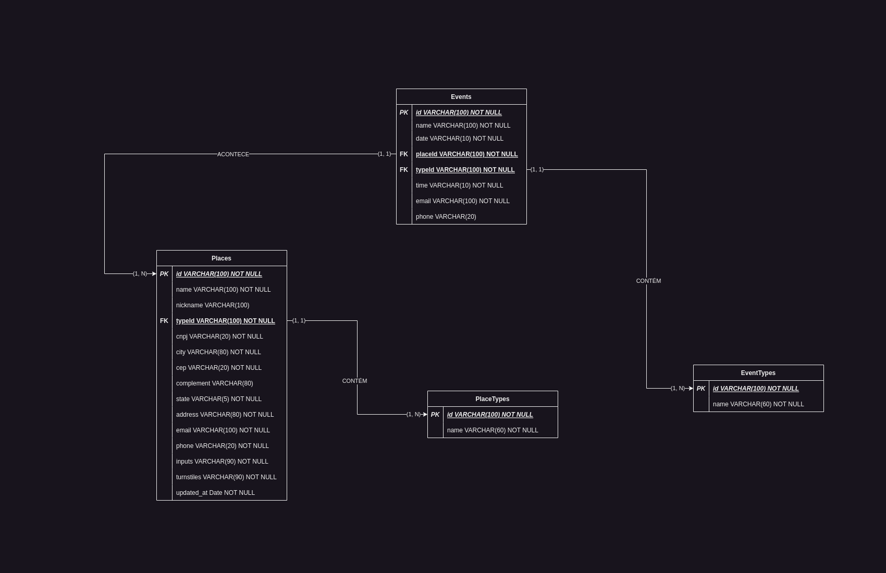
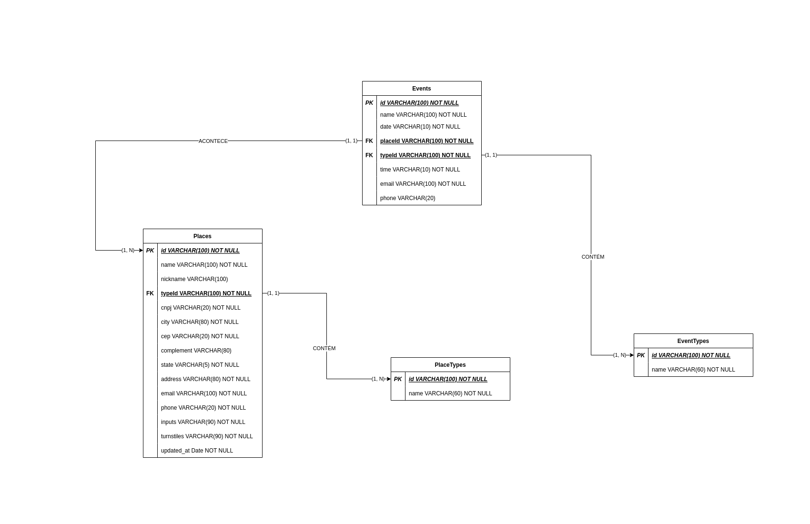

# Onentreé Application
## Uma aplicação para gerenciar um sistema de gerenciamento de ingressos e locais de eventos com acesso de catracas de reconhecimento facial.

### Iniciando back-end com o Docker

_Lembre-se de conferir as variáveis de ambiente em .env_.

_Crie um arquivo .env e cole o conteúdo de .env.development dentro para que as migrações do banco de dados rodem_.

```
$ cd onentree-backend
$ docker-compose up --build
```

### Iniciando front-end

```
$ cd onentree-frontend
$ npm install
```

### Rodando aplicação em modo de desenvolvimento

```
$ npm run dev
```

Após esses passos seu app já está pronto para uso na porta padrão do Vite.
Você pode conferir todos os endpoints em ```http://localhost:3000/api``` onde o Swagger está rodando.


### Modelagem do banco de dados



